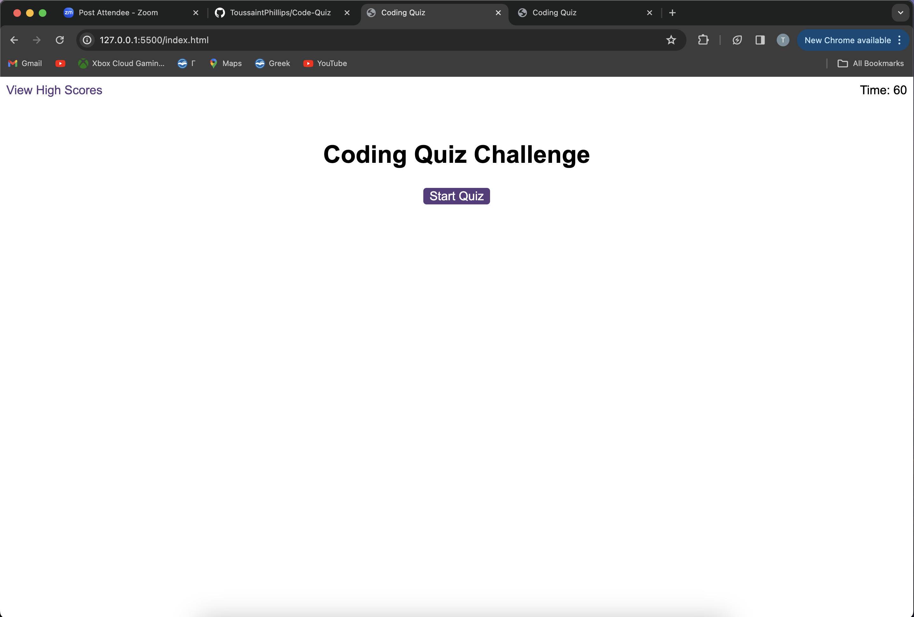
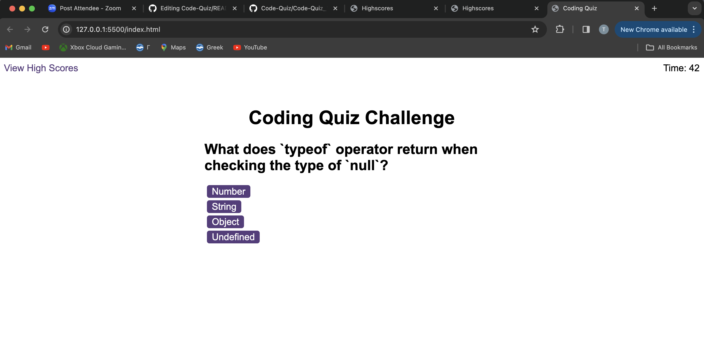
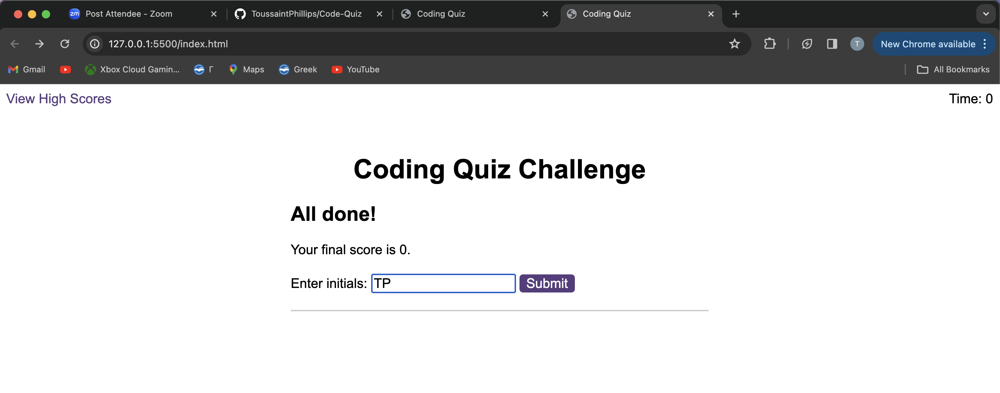
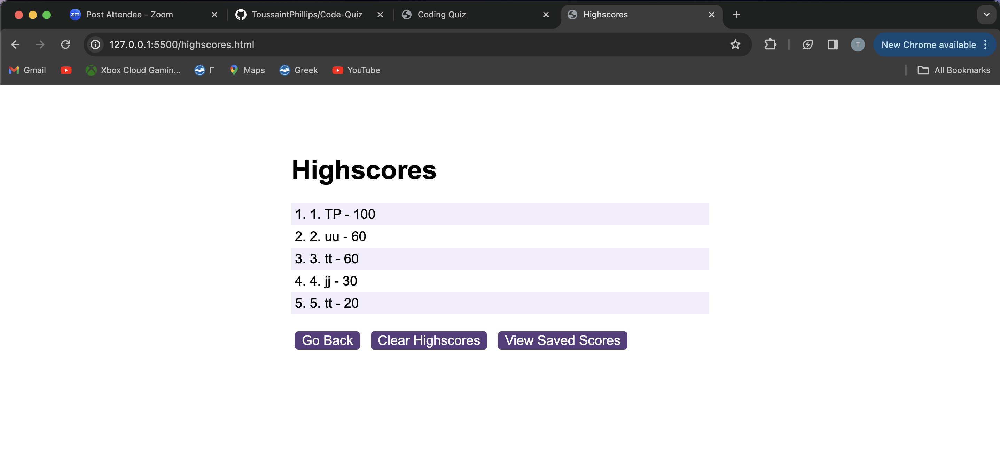

# Code Quiz 

## Code Quiz

A coding quiz application designed to test and enhance your JavaScript fundamentals.

- [View on GitHub](https://github.com/ToussaintPhillips/Code-Quiz)
- [View Live Demo](https://toussaintphillips.github.io/Code-Quiz/)
- [Report Bug](https://github.com/ToussaintPhillips/Code-Quiz/issues)
- [Request Feature](https://github.com/ToussaintPhillips/Code-Quiz/issues)

## About The Project



### Features

- **Timer Functionality**: A countdown timer adds an element of challenge, pushing you to answer questions swiftly.
- **Multiple-Choice Questions**: Engage with a set of JavaScript-related multiple-choice questions, testing your knowledge.
- **Score Tracking**: Track your progress with a dynamically updated score based on correct answers.
- **High Scores**: Save and display your highest scores to compare your performance.
- **Responsive Design**: Enjoy a seamless experience on various screen sizes.

## Usage

1. **Clone the Repository**:
    ```bash
    git clone https://github.com/ToussaintPhillips/Code-Quiz.git
    ```

2. **Navigate to the Project Directory**:
    ```bash
    cd Code-Quiz
    ```

3. **Open `index.html` in a Web Browser**: Launch the `index.html` file in your preferred web browser to start the quiz.

4. **Answer Questions**: Click on the provided options to answer the multiple-choice questions.

5. **Quiz End and Scoring**:
   - The quiz ends when you've answered all questions or when the timer reaches zero.
   - Your final score is calculated based on the number of correct answers and the time remaining.

6. **Save High Score**:
   - After completing the quiz, enter your initials in the input field provided.
   - Click the "Submit" button to save your high score.

7. **View High Scores**:
   - Click on the "View High Scores" link to see a list of the highest scores achieved by various users.

8. **Repeat and Improve**:
   - Feel free to take the quiz multiple times to improve your score and challenge your JavaScript knowledge.

## Screenshots






## Technologies

- HTML
- CSS
- JavaScript

## Contributing

Contributions are welcome! If you find any issues or have suggestions for improvement, please create a new issue or submit a pull request.

## Contact

For any inquiries or feedback, feel free to contact us:

- [Email](toussaintphillips@gmail.com)
- [LinkedIn](https://www.linkedin.com/in/toussaint-phillips/)

## License

Distributed under the MIT License. See `LICENSE` for more details.
```


